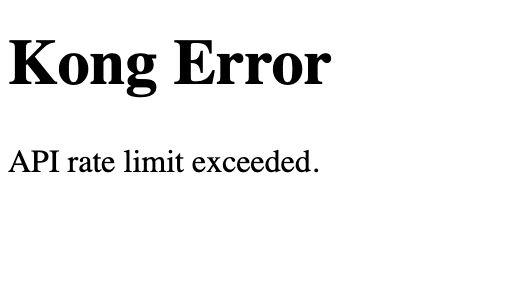

# Consul with Kubernetes Ingress

## Prerequisites

1. Install a Kubernetes cluster with a load balancer. This example
   uses GKE. You can run Terraform to create the cluster.
   ```shell
   cd cluster && terraform init && terraform apply
   ```

1. Install Consul 1.10+ to the Kubernetes cluster.
   ```shell
   helm install consul hashicorp/consul --version v0.32.0-beta3 --values consul.yaml
   ```

   > NOTE: You must have ACLs enabled in order for app-aware intentions to work. The
     `values.yaml` does enable them, so make sure to get an ACL token if you want to
     access the Consul cluster.

1. Apply intentions and proxy defaults to Consul on Kubernetes.
   ```shell
   kubectl apply -f consul/
   ```

1. Deploy the example workloads, UI and web, and intentions for
   services.
   ```shell
   kubectl apply -f apps/
   ```

## Kong

We use Kong's Helm chart to install Kong Ingress.

> NOTE: We set the service account name to `<helm name>-proxy`
  because Consul needs it to be the same as the service for ACLs.

1. Add and install the Kong Helm chart.
   ```shell
   helm repo add kong https://charts.konghq.com
   helm repo update
   ```

1. Review `kong/values.yaml`. We need to add a few annotations and make some
   updates to the Kong deployment.
   - Define the service account name for the ingress controller to `example-kong-proxy`.
     The service account name needs to match the service name for Consul ACLs.
   - Update all `livenessProbe` and `readinessProbe` to TCP (for now).
   - Add `podAnnotations` for Consul to:
     - Inject the sidecar proxy
     - Enable transparent proxy
     - Overwrite probes
     - Exclude inbound ports for 8000 and 8443. This allows the load balancer
       to access the proxy!

1. Deploy the Kong proxy and ingress controller.
   ```shell
   helm install -n default example kong/kong -f kong/values.yaml
   ```

1. Apply the Kong Ingress and rate-limiting plugin for the UI.
   ```shell
   kubectl apply -f kong/kubernetes/
   ```

1. Get the load balancer IP address for Kong proxy and open it in your browser.
   ```shell
   kubectl get svc example-kong-proxy  -o jsonpath="{.status.loadBalancer.ingress[*].ip}"
   ```

1. Add `/ui` to the end of the URL in your browser.
   You should be able to access the fake-service UI. It will use Consul to load balance
   between a baseline and canary version of `web`.
   

1. If you refresh the browser, you'll eventually get an error that Kong is rate-limiting
   requests to the API.
   


## Cleanup

Delete Kong resources.

```shell
kubectl delete -f kong/kubernetes/
```

Delete Kong proxy and ingress controller.

```shell
helm del example
```

Delete applications.

```shell
kubectl delete -f apps/
```

Delete Consul resources.

```shell
kubectl delete -f consul/
```

Delete Consul Helm chart.

```shell
helm del consul
```